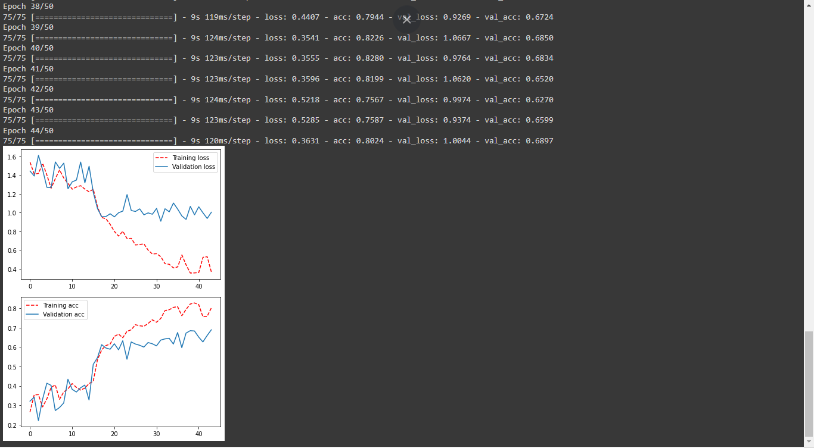
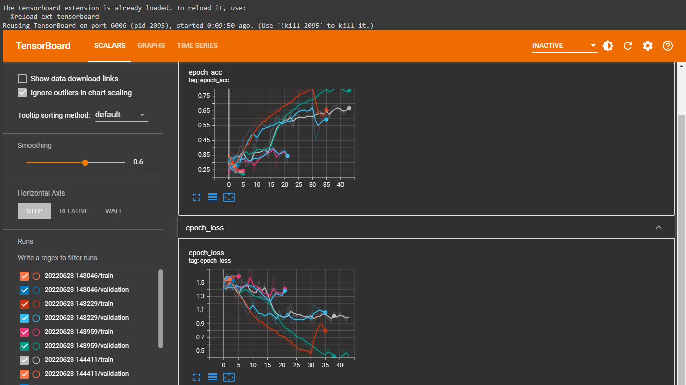

# **NLP TUTORIAL**
 Categorize unseen articles into several categories

## Source of data/ URL towards the data that I trained
https://raw.githubusercontent.com/susanli2016/PyCon-Canada-2019-NLP-Tutorial/master/bbc-text.csv

## Training data by using GOOGLE COLAB

### **side note** 📓
### Just increased ==epoch size in google colab to get higher accuracy==

### Tensorboard results 📈

